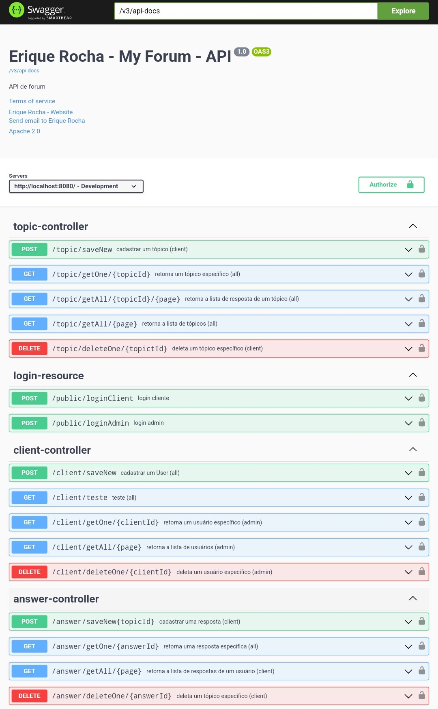

# myforum

## Apresentação:
Esta aplicação tem como objetivo completar o desafio Alura Oracle One de desenvolver uma API básica de forum.

### Tecnologias:
* Java 17
* SpringBoot 3.1.2
* Spring Security
* JWT
* Password Encoder
* PostgreSQL
* SpringDataJpa
* Hibernate
* SpringWeb
* Swagger
* Flyway

### PostgreSQL:
```XML
<dependency>
	<groupId>org.postgresql</groupId>
  <artifactId>postgresql</artifactId>
	<scope>runtime</scope>
</dependency>
```
drive para a utilização do SGBD PostgreSQL

### Swagger:
```XML
<dependency>
  <groupId>org.springdoc</groupId>
  <artifactId>springdoc-openapi-starter-webmvc-ui</artifactId>
  <version>2.1.0</version>
</dependency>
```
biblioteca que ajuda a automatizar a geração de documentação da API usando projetos de inicialização do spring

### Spring security:
```XML
<dependency>
  <groupId>org.springframework.boot</groupId>
	<artifactId>spring-boot-starter-security</artifactId>
</dependency>
```
O Spring Security é uma estrutura que fornece autenticação, autorização e proteção. Com suporte de primeira classe para proteger aplicativos imperativos e reativos, é o padrão de proteção para aplicativos baseados em Spring

### Json web token:
```XML
<dependency>
  <groupId>com.auth0</groupId>
  <artifactId>java-jwt</artifactId>
  <version>4.4.0</version>
</dependency>
```
JSON Web Token (JWT) é um padrão que define uma maneira compacta e independente para transmitir informações com segurança entre as partes como um objeto JSON

### Flyway:
```XML
<dependency>
	<groupId>org.flywaydb</groupId>
	<artifactId>flyway-core</artifactId>
</dependency>
```
ajuda com a migração de banco de dados, no caso, está sendo utilizado para que a aplicação inicie com um administrador

### Spring Data JPA:
```XML
<dependency>
  <groupId>org.springframework.boot</groupId>
  <artifactId>spring-boot-starter-data-jpa</artifactId>
</dependency>
```
um módulo do Spring Boot que interagem com bancos de dados relacionais usando JPA (Java Persistence API).

login do adm:
```
email: admin@exemplo.com
senha: 4321
```


### Swagger:


Com base na imagem a cima é possivel identificar quais end points foram desenvlvidos


